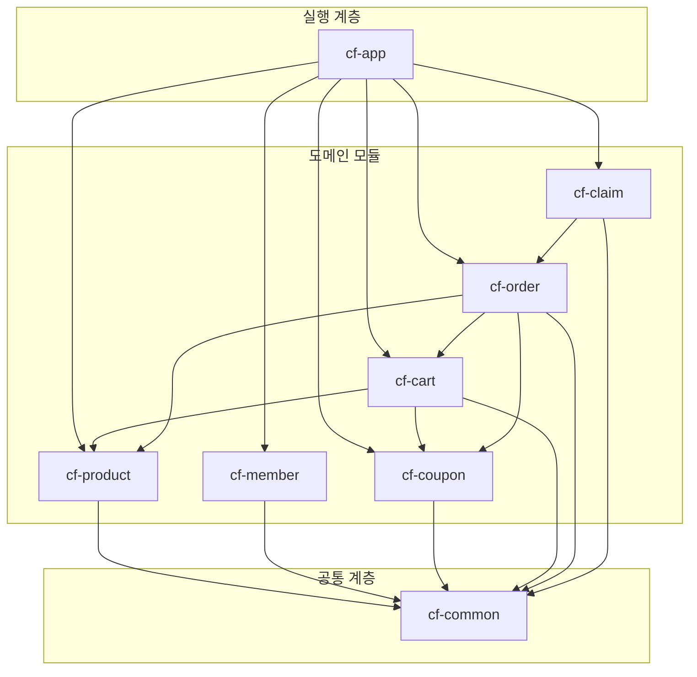
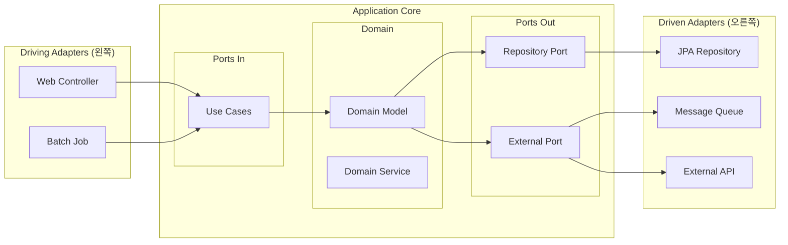

# CouponFit Commerce - 시스템 아키텍처 설계서

> 최종 업데이트: 2026년 1월

---

## 목차

1. [개요](#1-개요)
2. [모듈러 모놀리스 구조](#2-모듈러-모놀리스-구조)
3. [Hexagonal Architecture](#3-hexagonal-architecture)
4. [패키지 구조](#4-패키지-구조)
5. [ERD 요약](#5-erd-요약)
6. [API 엔드포인트 설계](#6-api-엔드포인트-설계)
7. [개발 가이드라인](#7-개발-가이드라인)

---

## 1. 개요

### 1.1 프로젝트 목표

- **쿠폰 최적화 특화 이커머스 플랫폼**: 대용량 쿠폰 처리 및 최적 매칭 알고리즘
- **복합 조건 쿠폰 지원**: 브랜드, 등급, 최소/최대 주문금액 조합
- **모듈러 모놀리스 + Hexagonal 아키텍처**: 학습 및 포트폴리오 목적

### 1.2 기술 스택

| Category | Stack |
|----------|-------|
| **Language** | Java 25 |
| **Framework** | Spring Boot 3.5.8 |
| **ORM** | Spring Data JPA, QueryDSL |
| **Database** | MySQL (운영), H2 (테스트) |
| **Auth** | Spring Security + OAuth2 |
| **Test** | JUnit5, AssertJ, Mockito |

---

## 2. 모듈러 모놀리스 구조

### 2.1 모듈 구성

```
coupon-fit/
├── cf-app/           # 메인 실행 모듈 (Application Entry Point)
├── cf-common/        # 공통 모듈 (Shared Utilities, Exceptions)
├── cf-product/       # 상품 모듈 ✅ 완료
├── cf-member/        # 회원 모듈 (예정)
├── cf-coupon/        # 쿠폰 모듈 (예정)
├── cf-cart/          # 장바구니 모듈 (예정)
├── cf-order/         # 주문 모듈 (예정)
└── cf-claim/         # 클레임 모듈 (예정)
```

### 2.2 모듈 의존성



### 2.3 모듈별 역할

| 모듈 | 역할 | 주요 기능 |
|------|------|----------|
| **cf-app** | 애플리케이션 실행 | Main 클래스, 설정 파일, 글로벌 설정 |
| **cf-common** | 공통 유틸리티 | 예외 처리, 공통 DTO, 유틸리티 |
| **cf-product** | 상품 도메인 | 상품 CRUD, 검색, 브랜드, 카테고리 |
| **cf-member** | 회원 도메인 | 소셜 로그인, 회원 등급, 배송지 |
| **cf-coupon** | 쿠폰 도메인 | 쿠폰 발급, 복합 조건, 최적 매칭 |
| **cf-cart** | 장바구니 도메인 | 장바구니 관리, 쿠폰 미리보기 |
| **cf-order** | 주문 도메인 | 주문 생성, 결제, 주문 상태 관리 |
| **cf-claim** | 클레임 도메인 | 취소, 반품, 환불, 쿠폰 안분 |

---

## 3. Hexagonal Architecture

### 3.1 아키텍처 개요



### 3.2 계층별 역할

| 계층 | 패키지 | 역할 |
|------|--------|------|
| **Adapter In (Web)** | `adapter.in.web` | REST Controller, Request/Response DTO |
| **Use Case (Port In)** | `application.port.in` | 입력 Port 인터페이스, Command |
| **Service** | `application.service` | Use Case 구현체 |
| **Port Out** | `application.port.out` | 출력 Port 인터페이스 |
| **Adapter Out (Persistence)** | `adapter.out.persistence` | JPA Entity, Repository 구현 |
| **Domain** | `domain` | 도메인 모델, 비즈니스 로직 |

---

## 4. 패키지 구조

### 4.1 단일 모듈 패키지 구조 (cf-product 예시)

```
cf-product/
└── src/
    ├── main/java/com/fittcha/product/
    │   ├── adapter/
    │   │   ├── in/
    │   │   │   └── web/
    │   │   │       ├── ProductController.java
    │   │   │       ├── RegisterProductRequest.java
    │   │   │       └── UpdateProductRequest.java
    │   │   └── out/
    │   │       └── persistence/
    │   │           ├── ProductJpaEntity.java
    │   │           ├── ProductJpaRepository.java
    │   │           ├── ProductMapper.java
    │   │           ├── ProductPersistenceAdapter.java
    │   │           ├── ProductQueryRepository.java
    │   │           └── ProductQueryRepositoryImpl.java
    │   ├── application/
    │   │   ├── port/
    │   │   │   ├── in/
    │   │   │   │   ├── DeleteProductUseCase.java
    │   │   │   │   ├── GetProductUseCase.java
    │   │   │   │   ├── RegisterProductCommand.java
    │   │   │   │   ├── RegisterProductUseCase.java
    │   │   │   │   ├── UpdateProductCommand.java
    │   │   │   │   └── UpdateProductUseCase.java
    │   │   │   └── out/
    │   │   │       ├── DeleteProductPort.java
    │   │   │       ├── LoadProductPort.java
    │   │   │       ├── SaveProductPort.java
    │   │   │       └── UpdateProductPort.java
    │   │   └── service/
    │   │       ├── DeleteProductService.java
    │   │       ├── GetProductService.java
    │   │       ├── RegisterProductService.java
    │   │       └── UpdateProductService.java
    │   └── domain/
    │       ├── Product.java
    │       └── ProductStatus.java
    └── test/java/com/fittcha/product/
        ├── adapter/in/web/
        │   └── ProductControllerTest.java
        ├── adapter/out/persistence/
        │   └── ProductPersistenceAdapterTest.java
        ├── application/service/
        │   └── RegisterProductServiceTest.java
        └── domain/
            └── ProductTest.java
```

### 4.2 전체 모듈에 적용할 표준 패키지 구조

```
cf-{module}/
└── src/main/java/com/fittcha/{module}/
    ├── adapter/
    │   ├── in/
    │   │   └── web/                    # REST Controller
    │   │       ├── {Module}Controller.java
    │   │       ├── {Action}Request.java
    │   │       └── {Action}Response.java
    │   └── out/
    │       ├── persistence/            # JPA Adapter
    │       │   ├── {Module}JpaEntity.java
    │       │   ├── {Module}JpaRepository.java
    │       │   ├── {Module}Mapper.java
    │       │   ├── {Module}PersistenceAdapter.java
    │       │   └── {Module}QueryRepositoryImpl.java
    │       └── external/               # 외부 API Adapter (필요시)
    │           └── {External}Adapter.java
    ├── application/
    │   ├── port/
    │   │   ├── in/                     # Input Port (Use Cases)
    │   │   │   ├── {Action}UseCase.java
    │   │   │   └── {Action}Command.java
    │   │   └── out/                    # Output Port
    │   │       ├── Load{Module}Port.java
    │   │       ├── Save{Module}Port.java
    │   │       └── {Action}Port.java
    │   └── service/                    # Use Case 구현체
    │       └── {Action}Service.java
    └── domain/                         # 도메인 모델
        ├── {Module}.java
        └── {Module}Status.java
```

---

## 5. ERD 요약

### 5.1 테이블 구성 (20개)

상세 명세는 [DATABASE_DESIGN.md](./DATABASE_DESIGN.md) 참조

| 도메인 | 테이블 | 설명 |
|--------|--------|------|
| **회원** | `MEMBER` | 회원 정보 |
|  | `MEMBER_ADDRESS` | 배송지 목록 |
| **상품** | `BRAND` | 브랜드 |
|  | `CATEGORY` | 3단계 카테고리 |
|  | `PRODUCT` | 상품 |
|  | `PRODUCT_IMAGE` | 상품 이미지 |
|  | `PRODUCT_OPTION` | 상품 옵션 |
| **쿠폰** | `COUPON` | 쿠폰 정책 |
|  | `COUPON_CONDITION` | 쿠폰 적용 조건 |
|  | `MEMBER_COUPON` | 회원 보유 쿠폰 |
| **장바구니** | `CART` | 장바구니 |
|  | `CART_ITEM` | 장바구니 상품 |
| **주문** | `ORDERS` | 주문 |
|  | `ORDER_ITEM` | 주문 상품 |
|  | `ORDER_COUPON` | 주문 적용 쿠폰 |
|  | `ORDER_PAYMENT` | 주문 결제 |
| **클레임** | `CLAIM` | 클레임 마스터 |
|  | `CLAIM_ITEM` | 클레임 상품 |
|  | `CLAIM_PAYMENT` | 클레임 환불 |

### 5.2 주요 코드 정의

#### 회원 등급 (MEMBER.grade)

| 코드 | 이름 | 조건 |
|------|------|------|
| `ROOKIE` | 루키 | 신규 가입 |
| `FAMILY` | 패밀리 | 누적 구매 10만원 이상 |
| `VIP` | VIP | 누적 구매 50만원 이상 |

#### 쿠폰 조건 타입 (COUPON_CONDITION.condition_type)

| 코드 | 설명 | 값 예시 |
|------|------|---------|
| `BRAND` | 특정 브랜드만 | `"1"` (brand_id) |
| `CATEGORY` | 특정 카테고리만 | `"5"` (category_id) |
| `PRODUCT` | 특정 상품만 | `"10"` (product_id) |
| `GRADE` | 특정 등급 이상 | `"VIP"` |
| `MIN_ORDER` | 최소 주문금액 | `"50000"` |
| `MAX_ORDER` | 최대 주문금액 | `"200000"` |
| `FIRST_ORDER` | 첫 주문만 | `"true"` |

#### 주문 상태 (ORDERS.status)

```
PENDING → PAID → PREPARING → SHIPPING → DELIVERED
    ↓
 CANCELED
```

| 코드 | 설명 |
|------|------|
| `PENDING` | 결제 대기 |
| `PAID` | 결제 완료 |
| `PREPARING` | 상품 준비중 |
| `SHIPPING` | 배송중 |
| `DELIVERED` | 배송 완료 |
| `CANCELED` | 주문 취소 |

---

## 6. API 엔드포인트 설계

### 6.1 API 공통 규칙

#### Base URL
```
/api
```

#### 응답 형식
```json
{
  "success": true,
  "data": { ... },
  "error": null
}
```

#### 에러 응답
```json
{
  "success": false,
  "data": null,
  "error": {
    "code": "PRODUCT_NOT_FOUND",
    "message": "상품을 찾을 수 없습니다."
  }
}
```

#### 페이징 응답
```json
{
  "success": true,
  "data": {
    "content": [ ... ],
    "page": 0,
    "size": 20,
    "totalElements": 100,
    "totalPages": 5,
    "hasNext": true,
    "hasPrevious": false
  }
}
```

---

### 6.2 Product API ✅ 완료

| Method | Endpoint | 설명 | 인증 |
|--------|----------|------|------|
| `POST` | `/api/products` | 상품 등록 | 관리자 |
| `GET` | `/api/products/{id}` | 상품 상세 조회 | - |
| `GET` | `/api/products` | 상품 목록/검색 | - |
| `PUT` | `/api/products/{id}` | 상품 수정 | 관리자 |
| `DELETE` | `/api/products/{id}` | 상품 삭제 | 관리자 |

#### 상품 검색 쿼리 파라미터

| 파라미터 | 타입 | 설명 |
|----------|------|------|
| `keyword` | String | 상품명 검색 |
| `brandId` | Long | 브랜드 필터 |
| `categoryId` | Long | 카테고리 필터 |
| `minPrice` | Integer | 최소 가격 |
| `maxPrice` | Integer | 최대 가격 |
| `status` | String | 상태 필터 |
| `page` | Integer | 페이지 번호 (0부터) |
| `size` | Integer | 페이지 크기 (기본 20) |
| `sort` | String | 정렬 (createdAt,desc) |

---

### 6.3 Member API (예정)

| Method | Endpoint | 설명 | 인증 |
|--------|----------|------|------|
| `POST` | `/api/auth/login/kakao` | 카카오 로그인 | - |
| `POST` | `/api/auth/login/naver` | 네이버 로그인 | - |
| `POST` | `/api/auth/login/google` | 구글 로그인 | - |
| `POST` | `/api/auth/logout` | 로그아웃 | 회원 |
| `GET` | `/api/members/me` | 내 정보 조회 | 회원 |
| `PUT` | `/api/members/me` | 내 정보 수정 | 회원 |
| `GET` | `/api/members/me/grade` | 내 등급 조회 | 회원 |
| `GET` | `/api/members/me/addresses` | 배송지 목록 | 회원 |
| `POST` | `/api/members/me/addresses` | 배송지 추가 | 회원 |
| `PUT` | `/api/members/me/addresses/{id}` | 배송지 수정 | 회원 |
| `DELETE` | `/api/members/me/addresses/{id}` | 배송지 삭제 | 회원 |

---

### 6.4 Coupon API (예정)

| Method | Endpoint | 설명 | 인증 |
|--------|----------|------|------|
| `POST` | `/api/coupons` | 쿠폰 생성 | 관리자 |
| `GET` | `/api/coupons` | 쿠폰 목록 | 관리자 |
| `GET` | `/api/coupons/{id}` | 쿠폰 상세 | 관리자 |
| `PUT` | `/api/coupons/{id}` | 쿠폰 수정 | 관리자 |
| `DELETE` | `/api/coupons/{id}` | 쿠폰 삭제 | 관리자 |
| `POST` | `/api/coupons/{id}/issue` | 쿠폰 다운로드 (발급) | 회원 |
| `GET` | `/api/members/me/coupons` | 내 쿠폰 목록 | 회원 |
| `GET` | `/api/members/me/coupons/available` | 사용 가능 쿠폰 | 회원 |

---

### 6.5 Cart API (예정)

| Method | Endpoint | 설명 | 인증 |
|--------|----------|------|------|
| `GET` | `/api/cart` | 장바구니 조회 | 회원 |
| `POST` | `/api/cart/items` | 장바구니 담기 | 회원 |
| `PUT` | `/api/cart/items/{id}` | 수량 변경 | 회원 |
| `DELETE` | `/api/cart/items/{id}` | 장바구니 삭제 | 회원 |
| `DELETE` | `/api/cart/items` | 장바구니 전체 삭제 | 회원 |
| `GET` | `/api/cart/coupons` | 적용 가능 쿠폰 목록 | 회원 |
| `POST` | `/api/cart/coupons/optimize` | 쿠폰 최적 조합 추천 | 회원 |

#### 장바구니 담기 Request

```json
{
  "productId": 1,
  "productOptionId": 10,
  "quantity": 2
}
```

#### 쿠폰 최적 조합 Response

```json
{
  "totalAmount": 150000,
  "totalDiscount": 25000,
  "finalAmount": 125000,
  "productCoupons": [
    {
      "cartItemId": 1,
      "memberCouponId": 100,
      "couponName": "브랜드A 10% 할인",
      "discountAmount": 10000
    }
  ],
  "cartCoupon": {
    "memberCouponId": 200,
    "couponName": "10,000원 할인",
    "discountAmount": 10000
  }
}
```

---

### 6.6 Order API (예정)

| Method | Endpoint | 설명 | 인증 |
|--------|----------|------|------|
| `POST` | `/api/orders` | 주문 생성 | 회원 |
| `GET` | `/api/orders` | 주문 목록 | 회원 |
| `GET` | `/api/orders/{id}` | 주문 상세 | 회원 |
| `POST` | `/api/orders/{id}/payment` | 결제 요청 | 회원 |
| `POST` | `/api/orders/{id}/payment/confirm` | 결제 승인 | 회원 |
| `POST` | `/api/orders/{id}/cancel` | 주문 취소 | 회원 |

#### 주문 생성 Request

```json
{
  "cartItemIds": [1, 2, 3],
  "productCouponMappings": [
    { "cartItemId": 1, "memberCouponId": 100 }
  ],
  "cartCouponId": 200,
  "shippingAddressId": 1,
  "paymentMethod": "CARD"
}
```

---

### 6.7 Claim API (예정)

| Method | Endpoint | 설명 | 인증 |
|--------|----------|------|------|
| `POST` | `/api/claims/cancel` | 주문 전체 취소 | 회원 |
| `POST` | `/api/claims/partial-cancel` | 부분 취소 | 회원 |
| `GET` | `/api/claims` | 클레임 목록 | 회원 |
| `GET` | `/api/claims/{id}` | 클레임 상세 | 회원 |

#### 부분 취소 Request

```json
{
  "orderId": 1,
  "reason": "단순 변심",
  "items": [
    { "orderItemId": 10, "quantity": 1 }
  ]
}
```

---

### 6.8 Admin API (관리자 전용)

| Method | Endpoint | 설명 | 인증 |
|--------|----------|------|------|
| `GET` | `/api/admin/members` | 회원 목록 | 관리자 |
| `GET` | `/api/admin/orders` | 전체 주문 목록 | 관리자 |
| `PUT` | `/api/admin/orders/{id}/status` | 주문 상태 변경 | 관리자 |
| `GET` | `/api/admin/claims` | 전체 클레임 목록 | 관리자 |
| `PUT` | `/api/admin/claims/{id}/approve` | 클레임 승인 | 관리자 |

---

## 7. 개발 가이드라인

### 7.1 네이밍 컨벤션

| 구분 | 규칙 | 예시 |
|------|------|------|
| **Controller** | `{도메인}Controller` | `ProductController` |
| **Service** | `{행위}Service` | `RegisterProductService` |
| **Use Case** | `{행위}UseCase` | `RegisterProductUseCase` |
| **Command** | `{행위}Command` | `RegisterProductCommand` |
| **Port** | `{행위}Port` | `SaveProductPort` |
| **Entity** | `{도메인}JpaEntity` | `ProductJpaEntity` |
| **Repository** | `{도메인}JpaRepository` | `ProductJpaRepository` |

### 7.2 테스트 전략

| 계층 | 테스트 종류 | 도구 |
|------|-------------|------|
| **Domain** | 단위 테스트 | JUnit5, AssertJ |
| **Service** | 단위 테스트 (Mock) | JUnit5, Mockito |
| **Repository** | 통합 테스트 | @DataJpaTest, H2 |
| **Controller** | API 테스트 | @WebMvcTest, MockMvc |  
| **E2E** | 통합 테스트 | @SpringBootTest |

### 7.3 예외 처리

```java
// 도메인 예외 (cf-common)
public class ProductNotFoundException extends BusinessException {
    public ProductNotFoundException(Long productId) {
        super(ErrorCode.PRODUCT_NOT_FOUND, "상품을 찾을 수 없습니다: " + productId);
    }
}

// GlobalExceptionHandler
@RestControllerAdvice
public class GlobalExceptionHandler {
    @ExceptionHandler(BusinessException.class)
    public ResponseEntity<ErrorResponse> handleBusinessException(BusinessException e) {
        return ResponseEntity
            .status(e.getStatus())
            .body(ErrorResponse.of(e.getErrorCode(), e.getMessage()));
    }
}
```

---

## 관련 문서

- [PRD](../couponfit-prd.md)
- [데이터베이스 설계서](./DATABASE_DESIGN.md)
- [ERD 이미지](./erd.png)
