# CouponFit Commerce - 데이터베이스 설계서

> 최종 업데이트: 2025년 12월

---

## 목차

1. [개요](#1-개요)
2. [ERD 다이어그램](#2-erd-다이어그램)
3. [테이블 상세 명세](#3-테이블-상세-명세)
4. [코드 정의](#4-코드-정의)
5. [인덱스 설계](#5-인덱스-설계)

---

## 1. 개요

### 1.1 테이블 구성 (17개)

| 도메인 | 테이블 | 설명 |
|--------|--------|------|
| **회원** | MEMBER | 회원 정보 |
| | MEMBER_ADDRESS | 배송지 목록 |
| **상품** | BRAND | 브랜드 |
| | CATEGORY | 3단계 카테고리 |
| | PRODUCT | 상품 |
| | PRODUCT_IMAGE | 상품 이미지 |
| | PRODUCT_OPTION | 상품 옵션 |
| **쿠폰** | COUPON | 쿠폰 정책 |
| | COUPON_CONDITION | 쿠폰 적용 조건 |
| | MEMBER_COUPON | 회원 보유 쿠폰 |
| **장바구니** | CART | 장바구니 |
| | CART_ITEM | 장바구니 상품 |
| **주문** | ORDERS | 주문 |
| | ORDER_ITEM | 주문 상품 |
| | ORDER_COUPON | 주문 적용 쿠폰 |
| | ORDER_PAYMENT | 주문 결제 |
| **클레임** | CLAIM | 클레임 마스터 |
| | CLAIM_ITEM | 클레임 상품 |
| | CLAIM_PAYMENT | 클레임 환불 |

### 1.2 Audit 필드 정책

| 구분 | 적용 필드 | 적용 테이블 |
|------|----------|-------------|
| 전체 | created_at, updated_at | 17개 전체 |
| 어드민 관리 | + created_by, updated_by | BRAND, CATEGORY, PRODUCT, PRODUCT_IMAGE, PRODUCT_OPTION, COUPON |

---

## 2. ERD 다이어그램

```mermaid
erDiagram
    %% ==================== 회원 ====================
    MEMBER {
        bigint id PK
        varchar email UK
        varchar password
        varchar name
        varchar phone
        varchar grade
        varchar status
        varchar login_type
        varchar social_id
        datetime created_at
        datetime updated_at
    }

    MEMBER_ADDRESS {
        bigint id PK
        bigint member_id FK
        varchar name
        varchar phone
        varchar zipcode
        varchar address
        varchar address_detail
        tinyint is_default
        datetime created_at
        datetime updated_at
    }

    %% ==================== 상품 ====================
    BRAND {
        bigint id PK
        varchar name UK
        varchar logo_url
        text description
        varchar status
        bigint created_by
        bigint updated_by
        datetime created_at
        datetime updated_at
    }

    CATEGORY {
        bigint id PK
        bigint parent_id FK
        varchar name
        int depth
        int sort_order
        bigint created_by
        bigint updated_by
        datetime created_at
        datetime updated_at
    }

    PRODUCT {
        bigint id PK
        bigint brand_id FK
        bigint category_id FK
        varchar name
        text description
        int price
        varchar status
        bigint created_by
        bigint updated_by
        datetime created_at
        datetime updated_at
    }

    PRODUCT_IMAGE {
        bigint id PK
        bigint product_id FK
        varchar image_url
        tinyint is_main
        int sort_order
        bigint created_by
        bigint updated_by
        datetime created_at
        datetime updated_at
    }

    PRODUCT_OPTION {
        bigint id PK
        bigint product_id FK
        varchar option1_name
        varchar option1_value
        varchar option2_name
        varchar option2_value
        int stock
        bigint created_by
        bigint updated_by
        datetime created_at
        datetime updated_at
    }

    %% ==================== 쿠폰 ====================
    COUPON {
        bigint id PK
        varchar name
        varchar description
        varchar coupon_type
        varchar discount_type
        int discount_value
        int max_discount
        varchar issue_type
        int total_quantity
        int issued_quantity
        datetime issue_start_at
        datetime issue_end_at
        int valid_days
        datetime valid_until
        bigint created_by
        bigint updated_by
        datetime created_at
        datetime updated_at
    }

    COUPON_CONDITION {
        bigint id PK
        bigint coupon_id FK
        varchar condition_type
        varchar condition_value
        datetime created_at
        datetime updated_at
    }

    MEMBER_COUPON {
        bigint id PK
        bigint member_id FK
        bigint coupon_id FK
        varchar status
        datetime issued_at
        datetime expired_at
        datetime used_at
        datetime created_at
        datetime updated_at
    }

    %% ==================== 장바구니 ====================
    CART {
        bigint id PK
        bigint member_id FK
        datetime created_at
        datetime updated_at
    }

    CART_ITEM {
        bigint id PK
        bigint cart_id FK
        bigint product_id FK
        bigint product_option_id FK
        int quantity
        datetime created_at
        datetime updated_at
    }

    %% ==================== 주문 ====================
    ORDERS {
        bigint id PK
        bigint member_id FK
        varchar order_no UK
        int total_amount
        int discount_amount
        int final_amount
        varchar status
        varchar receiver_name
        varchar receiver_phone
        varchar zipcode
        varchar address
        varchar address_detail
        datetime created_at
        datetime updated_at
    }

    ORDER_ITEM {
        bigint id PK
        bigint order_id FK
        bigint product_id FK
        bigint product_option_id FK
        varchar product_name
        varchar option_name
        int price
        int quantity
        int discount_amount
        varchar status
        datetime created_at
        datetime updated_at
    }

    ORDER_COUPON {
        bigint id PK
        bigint order_id FK
        bigint order_item_id FK
        bigint member_coupon_id FK
        int discount_amount
        datetime created_at
        datetime updated_at
    }

    ORDER_PAYMENT {
        bigint id PK
        bigint order_id FK
        varchar payment_key
        varchar method
        int amount
        varchar status
        datetime paid_at
        datetime created_at
        datetime updated_at
    }

    %% ==================== 클레임 ====================
    CLAIM {
        bigint id PK
        bigint order_id FK
        varchar claim_no UK
        varchar claim_type
        varchar status
        varchar reason
        datetime completed_at
        datetime created_at
        datetime updated_at
    }

    CLAIM_ITEM {
        bigint id PK
        bigint claim_id FK
        bigint order_item_id FK
        int quantity
        int refund_amount
        int coupon_refund_amount
        datetime created_at
        datetime updated_at
    }

    CLAIM_PAYMENT {
        bigint id PK
        bigint claim_id FK
        varchar payment_key
        int refund_amount
        varchar status
        datetime refunded_at
        datetime created_at
        datetime updated_at
    }

    %% ==================== 관계 ====================
    MEMBER ||--o{ MEMBER_ADDRESS : "배송지"
    MEMBER ||--o{ MEMBER_COUPON : "보유쿠폰"
    MEMBER ||--o| CART : "장바구니"
    MEMBER ||--o{ ORDERS : "주문"

    BRAND ||--o{ PRODUCT : "상품"
    CATEGORY ||--o{ CATEGORY : "하위카테고리"
    CATEGORY ||--o{ PRODUCT : "상품"
    PRODUCT ||--o{ PRODUCT_IMAGE : "이미지"
    PRODUCT ||--o{ PRODUCT_OPTION : "옵션"

    COUPON ||--o{ COUPON_CONDITION : "조건"
    COUPON ||--o{ MEMBER_COUPON : "발급"

    CART ||--o{ CART_ITEM : "담긴상품"
    CART_ITEM }o--|| PRODUCT : "상품"
    CART_ITEM }o--|| PRODUCT_OPTION : "옵션"

    ORDERS ||--o{ ORDER_ITEM : "주문상품"
    ORDERS ||--o{ ORDER_COUPON : "적용쿠폰"
    ORDERS ||--|| ORDER_PAYMENT : "결제"
    ORDERS ||--o{ CLAIM : "클레임"

    ORDER_ITEM }o--|| PRODUCT : "상품"
    ORDER_ITEM }o--|| PRODUCT_OPTION : "옵션"
    ORDER_COUPON }o--|| MEMBER_COUPON : "사용쿠폰"

    CLAIM ||--o{ CLAIM_ITEM : "클레임상품"
    CLAIM ||--o| CLAIM_PAYMENT : "환불"
    CLAIM_ITEM }o--|| ORDER_ITEM : "주문상품"
```



---

## 3. 테이블 상세 명세

### 3.1 회원 도메인

#### MEMBER (회원)

| 필드명 | 타입 | NULL | DEFAULT | 설명 |
|--------|------|------|---------|------|
| id | BIGINT | NO | AUTO_INCREMENT | 회원 고유 ID (PK) |
| email | VARCHAR(100) | NO | - | 로그인 이메일 |
| password | VARCHAR(255) | YES | NULL | 비밀번호 (소셜 로그인은 NULL) |
| name | VARCHAR(50) | NO | - | 회원 이름 |
| phone | VARCHAR(20) | YES | NULL | 휴대폰 번호 |
| grade | VARCHAR(20) | NO | 'ROOKIE' | 회원 등급 (ROOKIE/FAMILY/VIP) |
| status | VARCHAR(20) | NO | 'ACTIVE' | 회원 상태 (ACTIVE/WITHDRAWN) |
| login_type | VARCHAR(20) | NO | 'EMAIL' | 로그인 타입 (EMAIL/KAKAO/NAVER) |
| social_id | VARCHAR(100) | YES | NULL | 소셜 로그인 고유 ID |
| created_at | DATETIME | NO | CURRENT_TIMESTAMP | 생성일시 |
| updated_at | DATETIME | NO | CURRENT_TIMESTAMP ON UPDATE | 수정일시 |

**INDEX:**
```sql
uk_member_email (email) UNIQUE
idx_member_grade (grade)
idx_member_login_type_social_id (login_type, social_id)
```

---

#### MEMBER_ADDRESS (회원 배송지)

| 필드명 | 타입 | NULL | DEFAULT | 설명 |
|--------|------|------|---------|------|
| id | BIGINT | NO | AUTO_INCREMENT | 배송지 고유 ID (PK) |
| member_id | BIGINT | NO | - | 회원 ID (FK) |
| name | VARCHAR(50) | NO | - | 받는 사람 이름 |
| phone | VARCHAR(20) | NO | - | 받는 사람 연락처 |
| zipcode | VARCHAR(10) | NO | - | 우편번호 |
| address | VARCHAR(200) | NO | - | 기본 주소 |
| address_detail | VARCHAR(100) | YES | NULL | 상세 주소 |
| is_default | TINYINT(1) | NO | 0 | 기본 배송지 여부 |
| created_at | DATETIME | NO | CURRENT_TIMESTAMP | 생성일시 |
| updated_at | DATETIME | NO | CURRENT_TIMESTAMP ON UPDATE | 수정일시 |

**INDEX:**
```sql
idx_member_address_member_id (member_id)
idx_member_address_default (member_id, is_default)
```

---

### 3.2 상품 도메인

#### BRAND (브랜드)

| 필드명 | 타입 | NULL | DEFAULT | 설명 |
|--------|------|------|---------|------|
| id | BIGINT | NO | AUTO_INCREMENT | 브랜드 고유 ID (PK) |
| name | VARCHAR(100) | NO | - | 브랜드명 |
| logo_url | VARCHAR(500) | YES | NULL | 로고 이미지 URL |
| description | TEXT | YES | NULL | 브랜드 설명 |
| status | VARCHAR(20) | NO | 'ACTIVE' | 상태 (ACTIVE/INACTIVE) |
| created_by | BIGINT | YES | NULL | 생성자 ID |
| updated_by | BIGINT | YES | NULL | 수정자 ID |
| created_at | DATETIME | NO | CURRENT_TIMESTAMP | 생성일시 |
| updated_at | DATETIME | NO | CURRENT_TIMESTAMP ON UPDATE | 수정일시 |

**INDEX:**
```sql
uk_brand_name (name) UNIQUE
idx_brand_status (status)
```

---

#### CATEGORY (카테고리)

| 필드명 | 타입 | NULL | DEFAULT | 설명 |
|--------|------|------|---------|------|
| id | BIGINT | NO | AUTO_INCREMENT | 카테고리 고유 ID (PK) |
| parent_id | BIGINT | YES | NULL | 상위 카테고리 ID (FK) |
| name | VARCHAR(100) | NO | - | 카테고리명 |
| depth | INT | NO | 1 | 카테고리 깊이 (1/2/3) |
| sort_order | INT | NO | 0 | 정렬 순서 |
| created_by | BIGINT | YES | NULL | 생성자 ID |
| updated_by | BIGINT | YES | NULL | 수정자 ID |
| created_at | DATETIME | NO | CURRENT_TIMESTAMP | 생성일시 |
| updated_at | DATETIME | NO | CURRENT_TIMESTAMP ON UPDATE | 수정일시 |

**INDEX:**
```sql
idx_category_parent_id (parent_id)
idx_category_depth (depth)
idx_category_sort (parent_id, sort_order)
```

---

#### PRODUCT (상품)

| 필드명 | 타입 | NULL | DEFAULT | 설명 |
|--------|------|------|---------|------|
| id | BIGINT | NO | AUTO_INCREMENT | 상품 고유 ID (PK) |
| brand_id | BIGINT | NO | - | 브랜드 ID (FK) |
| category_id | BIGINT | NO | - | 카테고리 ID (FK) |
| name | VARCHAR(200) | NO | - | 상품명 |
| description | TEXT | YES | NULL | 상품 설명 |
| price | INT | NO | 0 | 판매가 |
| status | VARCHAR(20) | NO | 'ON_SALE' | 상태 (ON_SALE/SOLD_OUT/STOPPED) |
| created_by | BIGINT | YES | NULL | 생성자 ID |
| updated_by | BIGINT | YES | NULL | 수정자 ID |
| created_at | DATETIME | NO | CURRENT_TIMESTAMP | 생성일시 |
| updated_at | DATETIME | NO | CURRENT_TIMESTAMP ON UPDATE | 수정일시 |

**INDEX:**
```sql
idx_product_brand_id (brand_id)
idx_product_category_id (category_id)
idx_product_status (status)
idx_product_created_at (created_at DESC)
idx_product_price (price)
```

---

#### PRODUCT_IMAGE (상품 이미지)

| 필드명 | 타입 | NULL | DEFAULT | 설명 |
|--------|------|------|---------|------|
| id | BIGINT | NO | AUTO_INCREMENT | 이미지 고유 ID (PK) |
| product_id | BIGINT | NO | - | 상품 ID (FK) |
| image_url | VARCHAR(500) | NO | - | 이미지 URL |
| is_main | TINYINT(1) | NO | 0 | 대표 이미지 여부 |
| sort_order | INT | NO | 0 | 정렬 순서 |
| created_by | BIGINT | YES | NULL | 생성자 ID |
| updated_by | BIGINT | YES | NULL | 수정자 ID |
| created_at | DATETIME | NO | CURRENT_TIMESTAMP | 생성일시 |
| updated_at | DATETIME | NO | CURRENT_TIMESTAMP ON UPDATE | 수정일시 |

**INDEX:**
```sql
idx_product_image_product_id (product_id)
idx_product_image_main (product_id, is_main)
```

---

#### PRODUCT_OPTION (상품 옵션)

| 필드명 | 타입 | NULL | DEFAULT | 설명 |
|--------|------|------|---------|------|
| id | BIGINT | NO | AUTO_INCREMENT | 옵션 고유 ID (PK) |
| product_id | BIGINT | NO | - | 상품 ID (FK) |
| option1_name | VARCHAR(50) | NO | - | 옵션1 이름 (ex: 색상) |
| option1_value | VARCHAR(50) | NO | - | 옵션1 값 (ex: 블랙) |
| option2_name | VARCHAR(50) | YES | NULL | 옵션2 이름 (ex: 사이즈) |
| option2_value | VARCHAR(50) | YES | NULL | 옵션2 값 (ex: M) |
| stock | INT | NO | 0 | 재고 수량 |
| created_by | BIGINT | YES | NULL | 생성자 ID |
| updated_by | BIGINT | YES | NULL | 수정자 ID |
| created_at | DATETIME | NO | CURRENT_TIMESTAMP | 생성일시 |
| updated_at | DATETIME | NO | CURRENT_TIMESTAMP ON UPDATE | 수정일시 |

**INDEX:**
```sql
idx_product_option_product_id (product_id)
idx_product_option_stock (product_id, stock)
```

---

### 3.3 쿠폰 도메인

#### COUPON (쿠폰)

| 필드명 | 타입 | NULL | DEFAULT | 설명 |
|--------|------|------|---------|------|
| id | BIGINT | NO | AUTO_INCREMENT | 쿠폰 고유 ID (PK) |
| name | VARCHAR(100) | NO | - | 쿠폰명 |
| description | VARCHAR(500) | YES | NULL | 쿠폰 설명 |
| coupon_type | VARCHAR(20) | NO | - | 쿠폰 타입 (PRODUCT/CART) |
| discount_type | VARCHAR(20) | NO | - | 할인 타입 (FIXED/RATE) |
| discount_value | INT | NO | 0 | 할인 값 |
| max_discount | INT | YES | NULL | 최대 할인 금액 |
| issue_type | VARCHAR(20) | NO | 'DOWNLOAD' | 발급 타입 (DOWNLOAD/AUTO) |
| total_quantity | INT | YES | NULL | 총 발급 수량 (NULL=무제한) |
| issued_quantity | INT | NO | 0 | 발급된 수량 |
| issue_start_at | DATETIME | NO | - | 발급 시작일시 |
| issue_end_at | DATETIME | NO | - | 발급 종료일시 |
| valid_days | INT | YES | NULL | 유효일수 (발급일 기준) |
| valid_until | DATETIME | YES | NULL | 고정 만료일 |
| created_by | BIGINT | YES | NULL | 생성자 ID |
| updated_by | BIGINT | YES | NULL | 수정자 ID |
| created_at | DATETIME | NO | CURRENT_TIMESTAMP | 생성일시 |
| updated_at | DATETIME | NO | CURRENT_TIMESTAMP ON UPDATE | 수정일시 |

**INDEX:**
```sql
idx_coupon_type (coupon_type)
idx_coupon_issue_type (issue_type)
idx_coupon_issue_period (issue_start_at, issue_end_at)
```

---

#### COUPON_CONDITION (쿠폰 조건)

| 필드명 | 타입 | NULL | DEFAULT | 설명 |
|--------|------|------|---------|------|
| id | BIGINT | NO | AUTO_INCREMENT | 조건 고유 ID (PK) |
| coupon_id | BIGINT | NO | - | 쿠폰 ID (FK) |
| condition_type | VARCHAR(20) | NO | - | 조건 타입 |
| condition_value | VARCHAR(100) | NO | - | 조건 값 |
| created_at | DATETIME | NO | CURRENT_TIMESTAMP | 생성일시 |
| updated_at | DATETIME | NO | CURRENT_TIMESTAMP ON UPDATE | 수정일시 |

**INDEX:**
```sql
idx_coupon_condition_coupon_id (coupon_id)
idx_coupon_condition_type (coupon_id, condition_type)
```

---

#### MEMBER_COUPON (회원 보유 쿠폰)

| 필드명 | 타입 | NULL | DEFAULT | 설명 |
|--------|------|------|---------|------|
| id | BIGINT | NO | AUTO_INCREMENT | 보유 쿠폰 고유 ID (PK) |
| member_id | BIGINT | NO | - | 회원 ID (FK) |
| coupon_id | BIGINT | NO | - | 쿠폰 ID (FK) |
| status | VARCHAR(20) | NO | 'AVAILABLE' | 상태 (AVAILABLE/USED/EXPIRED) |
| issued_at | DATETIME | NO | CURRENT_TIMESTAMP | 발급일시 |
| expired_at | DATETIME | NO | - | 만료일시 |
| used_at | DATETIME | YES | NULL | 사용일시 |
| created_at | DATETIME | NO | CURRENT_TIMESTAMP | 생성일시 |
| updated_at | DATETIME | NO | CURRENT_TIMESTAMP ON UPDATE | 수정일시 |

**INDEX:**
```sql
idx_member_coupon_member_id (member_id)
idx_member_coupon_coupon_id (coupon_id)
idx_member_coupon_status (member_id, status)
idx_member_coupon_expired (member_id, status, expired_at)
```

---

### 3.4 장바구니 도메인

#### CART (장바구니)

| 필드명 | 타입 | NULL | DEFAULT | 설명 |
|--------|------|------|---------|------|
| id | BIGINT | NO | AUTO_INCREMENT | 장바구니 고유 ID (PK) |
| member_id | BIGINT | NO | - | 회원 ID (FK) |
| created_at | DATETIME | NO | CURRENT_TIMESTAMP | 생성일시 |
| updated_at | DATETIME | NO | CURRENT_TIMESTAMP ON UPDATE | 수정일시 |

**INDEX:**
```sql
uk_cart_member_id (member_id) UNIQUE
```

---

#### CART_ITEM (장바구니 상품)

| 필드명 | 타입 | NULL | DEFAULT | 설명 |
|--------|------|------|---------|------|
| id | BIGINT | NO | AUTO_INCREMENT | 장바구니 상품 고유 ID (PK) |
| cart_id | BIGINT | NO | - | 장바구니 ID (FK) |
| product_id | BIGINT | NO | - | 상품 ID (FK) |
| product_option_id | BIGINT | NO | - | 상품 옵션 ID (FK) |
| quantity | INT | NO | 1 | 수량 |
| created_at | DATETIME | NO | CURRENT_TIMESTAMP | 생성일시 |
| updated_at | DATETIME | NO | CURRENT_TIMESTAMP ON UPDATE | 수정일시 |

**INDEX:**
```sql
idx_cart_item_cart_id (cart_id)
uk_cart_item_option (cart_id, product_option_id) UNIQUE
```

---

### 3.5 주문 도메인

#### ORDERS (주문)

| 필드명 | 타입 | NULL | DEFAULT | 설명 |
|--------|------|------|---------|------|
| id | BIGINT | NO | AUTO_INCREMENT | 주문 고유 ID (PK) |
| member_id | BIGINT | NO | - | 회원 ID (FK) |
| order_no | VARCHAR(50) | NO | - | 주문번호 |
| total_amount | INT | NO | 0 | 총 상품금액 |
| discount_amount | INT | NO | 0 | 총 할인금액 |
| final_amount | INT | NO | 0 | 최종 결제금액 |
| status | VARCHAR(20) | NO | 'PENDING' | 주문 상태 |
| receiver_name | VARCHAR(50) | NO | - | 받는 사람 이름 |
| receiver_phone | VARCHAR(20) | NO | - | 받는 사람 연락처 |
| zipcode | VARCHAR(10) | NO | - | 우편번호 |
| address | VARCHAR(200) | NO | - | 기본 주소 |
| address_detail | VARCHAR(100) | YES | NULL | 상세 주소 |
| created_at | DATETIME | NO | CURRENT_TIMESTAMP | 생성일시 |
| updated_at | DATETIME | NO | CURRENT_TIMESTAMP ON UPDATE | 수정일시 |

**INDEX:**
```sql
uk_orders_order_no (order_no) UNIQUE
idx_orders_member_id (member_id)
idx_orders_status (status)
idx_orders_created_at (created_at DESC)
```

---

#### ORDER_ITEM (주문 상품)

| 필드명 | 타입 | NULL | DEFAULT | 설명 |
|--------|------|------|---------|------|
| id | BIGINT | NO | AUTO_INCREMENT | 주문 상품 고유 ID (PK) |
| order_id | BIGINT | NO | - | 주문 ID (FK) |
| product_id | BIGINT | NO | - | 상품 ID (FK) |
| product_option_id | BIGINT | NO | - | 상품 옵션 ID (FK) |
| product_name | VARCHAR(200) | NO | - | 주문 당시 상품명 |
| option_name | VARCHAR(100) | NO | - | 주문 당시 옵션명 |
| price | INT | NO | 0 | 주문 당시 가격 |
| quantity | INT | NO | 1 | 주문 수량 |
| discount_amount | INT | NO | 0 | 상품 쿠폰 할인금액 |
| status | VARCHAR(20) | NO | 'ORDERED' | 상태 (ORDERED/CANCELED) |
| created_at | DATETIME | NO | CURRENT_TIMESTAMP | 생성일시 |
| updated_at | DATETIME | NO | CURRENT_TIMESTAMP ON UPDATE | 수정일시 |

**INDEX:**
```sql
idx_order_item_order_id (order_id)
idx_order_item_product_id (product_id)
idx_order_item_status (order_id, status)
```

---

#### ORDER_COUPON (주문 적용 쿠폰)

| 필드명 | 타입 | NULL | DEFAULT | 설명 |
|--------|------|------|---------|------|
| id | BIGINT | NO | AUTO_INCREMENT | 적용 쿠폰 고유 ID (PK) |
| order_id | BIGINT | NO | - | 주문 ID (FK) |
| order_item_id | BIGINT | YES | NULL | 주문 상품 ID (FK, NULL=장바구니 쿠폰) |
| member_coupon_id | BIGINT | NO | - | 회원 보유 쿠폰 ID (FK) |
| discount_amount | INT | NO | 0 | 적용된 할인금액 |
| created_at | DATETIME | NO | CURRENT_TIMESTAMP | 생성일시 |
| updated_at | DATETIME | NO | CURRENT_TIMESTAMP ON UPDATE | 수정일시 |

**INDEX:**
```sql
idx_order_coupon_order_id (order_id)
idx_order_coupon_member_coupon_id (member_coupon_id)
```

---

#### ORDER_PAYMENT (주문 결제)

| 필드명 | 타입 | NULL | DEFAULT | 설명 |
|--------|------|------|---------|------|
| id | BIGINT | NO | AUTO_INCREMENT | 결제 고유 ID (PK) |
| order_id | BIGINT | NO | - | 주문 ID (FK) |
| payment_key | VARCHAR(200) | YES | NULL | 토스 결제키 |
| method | VARCHAR(50) | YES | NULL | 결제 수단 |
| amount | INT | NO | 0 | 결제 금액 |
| status | VARCHAR(20) | NO | 'PENDING' | 결제 상태 |
| paid_at | DATETIME | YES | NULL | 결제 완료일시 |
| created_at | DATETIME | NO | CURRENT_TIMESTAMP | 생성일시 |
| updated_at | DATETIME | NO | CURRENT_TIMESTAMP ON UPDATE | 수정일시 |

**INDEX:**
```sql
uk_order_payment_order_id (order_id) UNIQUE
idx_order_payment_payment_key (payment_key)
idx_order_payment_status (status)
```

---

### 3.6 클레임 도메인

#### CLAIM (클레임)

| 필드명 | 타입 | NULL | DEFAULT | 설명 |
|--------|------|------|---------|------|
| id | BIGINT | NO | AUTO_INCREMENT | 클레임 고유 ID (PK) |
| order_id | BIGINT | NO | - | 주문 ID (FK) |
| claim_no | VARCHAR(50) | NO | - | 클레임번호 |
| claim_type | VARCHAR(20) | NO | - | 클레임 타입 (CANCEL/PARTIAL_CANCEL) |
| status | VARCHAR(20) | NO | 'REQUESTED' | 클레임 상태 |
| reason | VARCHAR(500) | YES | NULL | 클레임 사유 |
| completed_at | DATETIME | YES | NULL | 처리 완료일시 |
| created_at | DATETIME | NO | CURRENT_TIMESTAMP | 생성일시 |
| updated_at | DATETIME | NO | CURRENT_TIMESTAMP ON UPDATE | 수정일시 |

**INDEX:**
```sql
uk_claim_claim_no (claim_no) UNIQUE
idx_claim_order_id (order_id)
idx_claim_status (status)
```

---

#### CLAIM_ITEM (클레임 상품)

| 필드명 | 타입 | NULL | DEFAULT | 설명 |
|--------|------|------|---------|------|
| id | BIGINT | NO | AUTO_INCREMENT | 클레임 상품 고유 ID (PK) |
| claim_id | BIGINT | NO | - | 클레임 ID (FK) |
| order_item_id | BIGINT | NO | - | 주문 상품 ID (FK) |
| quantity | INT | NO | 1 | 취소 수량 |
| refund_amount | INT | NO | 0 | 환불 상품금액 |
| coupon_refund_amount | INT | NO | 0 | 쿠폰 안분 환불금액 |
| created_at | DATETIME | NO | CURRENT_TIMESTAMP | 생성일시 |
| updated_at | DATETIME | NO | CURRENT_TIMESTAMP ON UPDATE | 수정일시 |

**INDEX:**
```sql
idx_claim_item_claim_id (claim_id)
idx_claim_item_order_item_id (order_item_id)
```

---

#### CLAIM_PAYMENT (클레임 환불)

| 필드명 | 타입 | NULL | DEFAULT | 설명 |
|--------|------|------|---------|------|
| id | BIGINT | NO | AUTO_INCREMENT | 환불 고유 ID (PK) |
| claim_id | BIGINT | NO | - | 클레임 ID (FK) |
| payment_key | VARCHAR(200) | YES | NULL | 토스 환불 결제키 |
| refund_amount | INT | NO | 0 | 총 환불금액 |
| status | VARCHAR(20) | NO | 'PENDING' | 환불 상태 |
| refunded_at | DATETIME | YES | NULL | 환불 완료일시 |
| created_at | DATETIME | NO | CURRENT_TIMESTAMP | 생성일시 |
| updated_at | DATETIME | NO | CURRENT_TIMESTAMP ON UPDATE | 수정일시 |

**INDEX:**
```sql
idx_claim_payment_claim_id (claim_id)
idx_claim_payment_status (status)
```

---

## 4. 코드 정의

### 4.1 회원 등급 (MEMBER.grade)

| 코드 | 이름 | 설명 |
|------|------|------|
| ROOKIE | 루키 | 신규/기본 등급 |
| FAMILY | 패밀리 | 중간 등급 |
| VIP | VIP | 최상위 등급 |

### 4.2 회원 상태 (MEMBER.status)

| 코드 | 이름 | 설명 |
|------|------|------|
| ACTIVE | 활성 | 정상 회원 |
| WITHDRAWN | 탈퇴 | 탈퇴한 회원 |

### 4.3 로그인 타입 (MEMBER.login_type)

| 코드 | 이름 | 설명 |
|------|------|------|
| EMAIL | 이메일 | 이메일/비밀번호 로그인 |
| KAKAO | 카카오 | 카카오 소셜 로그인 |
| NAVER | 네이버 | 네이버 소셜 로그인 |

### 4.4 상품 상태 (PRODUCT.status)

| 코드 | 이름 | 설명 |
|------|------|------|
| ON_SALE | 판매중 | 정상 판매 중 |
| SOLD_OUT | 품절 | 재고 없음 |
| STOPPED | 판매중지 | 판매 중지 |

### 4.5 쿠폰 타입 (COUPON.coupon_type)

| 코드 | 이름 | 설명 |
|------|------|------|
| PRODUCT | 상품 쿠폰 | 특정 상품에 적용 |
| CART | 장바구니 쿠폰 | 주문 전체에 적용 |

### 4.6 할인 타입 (COUPON.discount_type)

| 코드 | 이름 | 설명 |
|------|------|------|
| FIXED | 정액 | 금액 할인 (ex: 5,000원) |
| RATE | 정률 | 비율 할인 (ex: 10%) |

### 4.7 발급 타입 (COUPON.issue_type)

| 코드 | 이름 | 설명 |
|------|------|------|
| DOWNLOAD | 다운로드 | 클릭 시 발급 |
| AUTO | 자동 | 자동 발급 (웰컴, 등급 등) |

### 4.8 쿠폰 조건 타입 (COUPON_CONDITION.condition_type)

| 코드 | 이름 | 예시 |
|------|------|------|
| BRAND | 브랜드 | condition_value: "1" (브랜드 ID) |
| GRADE | 등급 | condition_value: "VIP" |
| MIN_ORDER | 최소 주문금액 | condition_value: "50000" |
| MAX_ORDER | 최대 주문금액 | condition_value: "200000" |

### 4.9 회원 쿠폰 상태 (MEMBER_COUPON.status)

| 코드 | 이름 | 설명 |
|------|------|------|
| AVAILABLE | 사용가능 | 사용 가능한 쿠폰 |
| USED | 사용완료 | 사용된 쿠폰 |
| EXPIRED | 만료 | 기간 만료된 쿠폰 |

### 4.10 주문 상태 (ORDERS.status)

| 코드 | 이름 | 설명 |
|------|------|------|
| PENDING | 입금대기 | 결제 대기 중 |
| PAID | 결제완료 | 결제 완료 |
| SHIPPING | 배송중 | 배송 중 |
| DELIVERED | 배송완료 | 배송 완료 |
| CONFIRMED | 구매확정 | 구매 확정 |

### 4.11 결제 상태 (ORDER_PAYMENT.status)

| 코드 | 이름 | 설명 |
|------|------|------|
| PENDING | 대기 | 결제 대기 |
| COMPLETED | 완료 | 결제 완료 |
| CANCELED | 취소 | 결제 취소 |
| FAILED | 실패 | 결제 실패 |

### 4.12 클레임 타입 (CLAIM.claim_type)

| 코드 | 이름 | 설명 |
|------|------|------|
| CANCEL | 전체취소 | 주문 전체 취소 |
| PARTIAL_CANCEL | 부분취소 | 일부 상품만 취소 |

### 4.13 클레임 상태 (CLAIM.status)

| 코드 | 이름 | 설명 |
|------|------|------|
| REQUESTED | 요청됨 | 클레임 요청 |
| PROCESSING | 처리중 | 처리 진행 중 |
| COMPLETED | 완료 | 처리 완료 |
| REJECTED | 거절 | 클레임 거절 |

---

## 5. 인덱스 설계

### 5.1 설계 원칙

1. **PK**: 자동으로 클러스터드 인덱스
2. **FK**: 조인 성능을 위해 인덱스 생성
3. **UNIQUE**: 비즈니스 키에 적용 (email, order_no 등)
4. **복합 인덱스**: WHERE 조건에 자주 같이 쓰이는 컬럼

### 5.2 인덱스 요약

| 테이블 | 인덱스 | 타입 | 컬럼 |
|--------|--------|------|------|
| MEMBER | uk_member_email | UNIQUE | email |
| MEMBER | idx_member_grade | INDEX | grade |
| BRAND | uk_brand_name | UNIQUE | name |
| PRODUCT | idx_product_created_at | INDEX | created_at DESC |
| CART | uk_cart_member_id | UNIQUE | member_id |
| CART_ITEM | uk_cart_item_option | UNIQUE | cart_id, product_option_id |
| ORDERS | uk_orders_order_no | UNIQUE | order_no |
| ORDER_PAYMENT | uk_order_payment_order_id | UNIQUE | order_id |
| CLAIM | uk_claim_claim_no | UNIQUE | claim_no |

---

## 다음 단계

- [ ] JPA 엔티티 설계
- [ ] DDL 스크립트 생성
- [ ] API 명세 작성
- [ ] 개발 환경 세팅
